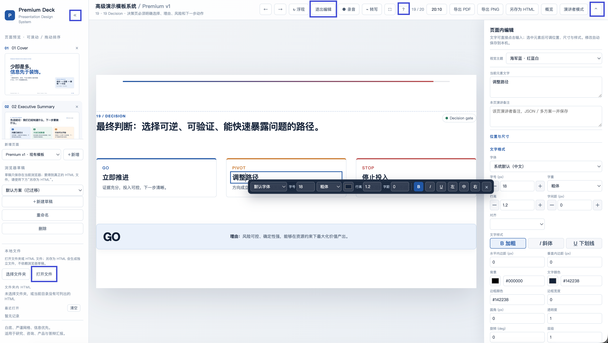

# HTML Presentation Template

一个可直接在浏览器打开和编辑的 19 页通用 HTML 演示模板。

## 在线预览

[打开 GitHub Pages](https://aaccchu.github.io/HTML_Presentation_Editor/)



## 直接下载

[下载 HTML 模板文件](https://github.com/aaccchu/HTML_Presentation_Editor/raw/refs/heads/main/index.html)

也可以右键保存下面的文件链接：

```text
https://github.com/aaccchu/HTML_Presentation_Editor/raw/refs/heads/main/index.html
```

## 使用方式

下载 `index.html` 后，使用最新版 Chrome 或 Edge 打开即可。项目为单文件 HTML，不需要安装依赖、构建工具或后端服务。

## 功能

### 通用模板

- 提供 19 页通用演示页面，覆盖封面、执行摘要、章节页、问题、背景、核心洞察、框架、流程、路线图、时间线、方案对比、四象限、证据链、数据、图表、研究结果、案例、系统架构和决策页面。
- 适用于项目汇报、研究答辩、技术评审、方案说明和产品汇报。
- 页面采用统一的白底、网格、字体和多色状态体系，页面内容不绑定具体行业或公司项目。

### 页面编辑

- 在编辑模式中直接修改页面文字。
- 调整选中元素的位置、宽高、字体、字号、字重、行高、字间距、对齐方式、粗体、斜体和下划线。
- 调整文字颜色、背景色、边框颜色、边框宽度、圆角、透明度、旋转角度和图层层级。
- 添加文本框、分隔线、卡片和图片框。
- 拖动、缩放和微调页面元素。
- 提供左对齐、水平居中、右对齐、顶对齐、垂直居中和底对齐。
- 提供置顶、上移、下移和置底等图层操作。
- 支持复制、粘贴、复制元素、删除元素、隐藏元素、撤销和重做。

### 页面与草稿管理

- 在页面缩略图中预览、跳转和拖动排序。
- 新增通用模板页面。
- 新建、重命名、切换和删除多个本地草稿。
- 支持页面概览视图和单页删除。
- 页面编辑内容自动保存到当前浏览器的本地存储中。

### 演示功能

- 上一页、下一页、首页、末页和浮现动画控制。
- 自动播放，可设置页面切换间隔。
- 全屏演示、顶部工具栏显示/隐藏和画布适屏缩放。
- 演讲者模式：显示当前页、下一页、演讲备注和计时器。
- 演示计时器和快捷键帮助面板。

### 文件与数据

- 打开本地 HTML 文件，或选择文件夹批量浏览其中的 HTML 文件。
- 保存为独立 HTML 文件，便于离线分享和归档。
- 导出和导入 JSON 草稿数据。
- 导出当前页面为 PNG，或导出为 PDF。
- 编辑和导出演讲备注。
- 本地记录最近打开的文件，不上传本地文件到项目服务器。

### 录音与转写

- 支持浏览器本地录音，并提供录音文件下载。
- 支持浏览器语音转写，可将当前转写内容插入页面备注。
- 录音和语音转写需要浏览器支持，并需要用户主动授权麦克风权限。

### 常用快捷键

- `←` / `→` 或空格：上一页 / 下一页。
- `Home` / `End`：跳到第一页 / 最后一页。
- `E`：切换编辑模式。
- `F`：进入或退出全屏。
- `S`：保存当前草稿。
- `?`：打开快捷键帮助。
- `⌘/Ctrl + Z`：撤销；`⌘/Ctrl + Shift + Z`：重做。
- `⌘/Ctrl + D`：复制选中元素。
- `⌘/Ctrl + Shift + H`：隐藏或显示顶部工具栏。

## 浏览器权限说明

- 直接预览、编辑、演示和本地草稿保存不需要后端服务。
- 打开本地文件、选择文件夹和保存文件依赖浏览器的 File System Access API；不支持时可使用普通文件选择和下载方式。
- 录音和语音转写依赖浏览器的媒体与语音识别能力，实际可用性取决于浏览器版本、操作系统和授权设置。

## License

本项目采用 [MIT License](LICENSE)。使用、修改或再发布时请保留版权声明和许可证文本。
